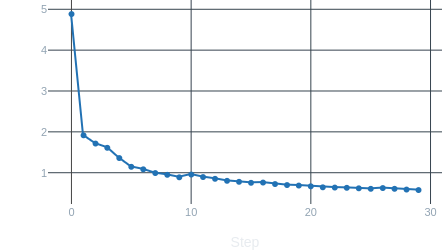
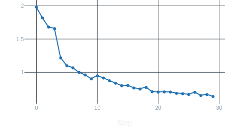
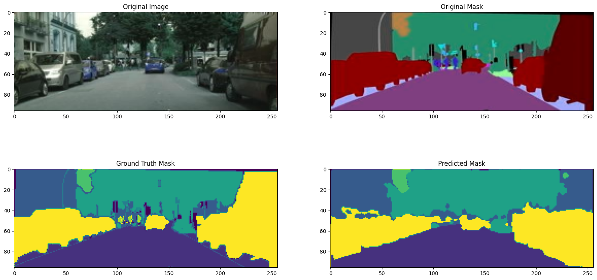

# Road Image Segmentation

## Project Overview

This project aims to develop a deep learning model for **road image segmentation** using a subset of the **Cityscapes dataset** ([Kaggle](https://www.kaggle.com/datasets/shuvoalok/cityscapes)). The model leverages a **U-Net architecture** implemented in **PyTorch** to perform pixel-wise segmentation of road features from urban images.

## Project Structure

The project follows a modular structure for easy replication and understanding:

```
img/                       # Output images and evaluation results
    *.png                   
model/                     # Directory for trained model weights
    *.pth                   
data.py                    # Script for data preprocessing
evaluate.py                # Script for model evaluation
image-segmentation.ipynb   # Jupyter Notebook demonstrating the segmentation workflow
inference.py               # Script for running inference with the trained model
model_unet.py              # U-Net architecture implementation
README.md                  # Project overview and instructions
train.py                   # Script for training the model
trainer.py                 # Helper functions for training
```

## Exploratory Data Analysis (EDA)

- The dataset contains **3475 pairs of road images** and corresponding **segmentation masks**, both of size **96x256 pixels**.
- The images and masks are in **RGB format**. 
- The dataset is split into:
  - **2975 training pairs**
  - **500 validation pairs**

## Model Architecture and Training

- The segmentation model is based on the **U-Net architecture** for multi-class segmentation.
- Training configuration:
  - **30 epochs**
  - **Batch size: 192**
  - **2xT4 GPUs on Kaggle** for faster model training.
- Optimisation: **Adam optimiser** with a learning rate schedule.

## Model Evaluation

**Loss Curves:**

- **Training loss** and **validation loss** are visualized to monitor convergence:
  - 
  - 

**Performance Metrics:**

- **Pixel Accuracy**: 0.80
- **Intersection over Union (IoU)**: 0.46

**Sample Predictions:**

- Examples of the model’s predictions vs ground truth:
  - 

## Conclusion

The initial results indicate that the model performs basic road segmentation, but there is significant room for improvement. To enhance performance:
- Explore more complex architectures (e.g., **DeepLabV3**, **EfficientNet-based U-Net**).
- Increase the number of **epochs** and experiment with different batch sizes.
- Augment the dataset to improve generalisation and segmentation quality.
